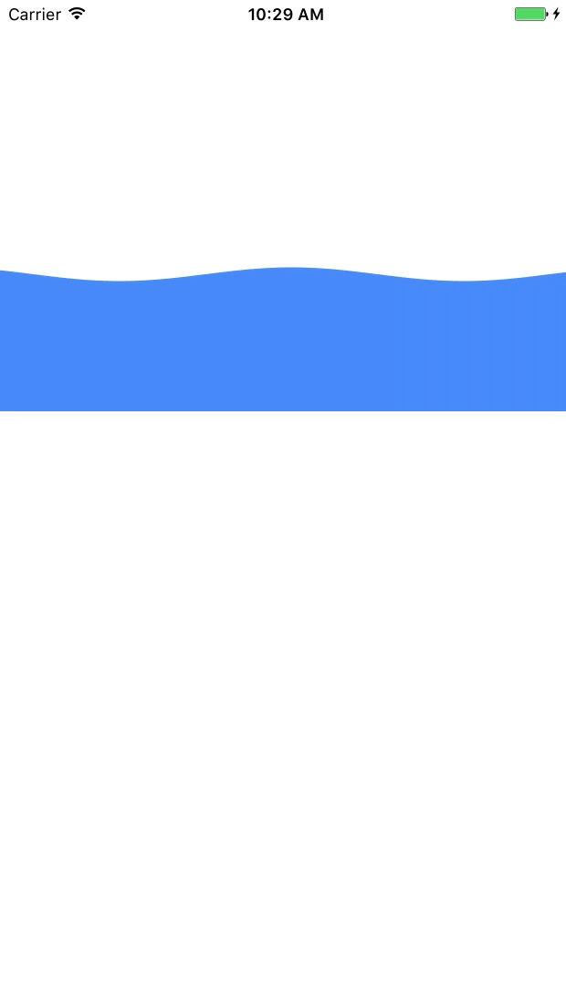

# ZZWaterWaveView

Use CAShapeLayer and CADisplayLink to make a view with water wave animation inside.

## y = Asin(ωx+φ)+C ？
- A 振幅，用来调整波浪高度 
- ω 周期，用来调整屏幕内显示的波浪数量 
- φ 波浪横向偏移，用来调整波浪流动 
- C 波浪纵向位置，用来调整波浪竖直位置

## CADisplayLink ？

CADisplayLink 其实是一个定时器，适用于 UI 的不停刷新，如自定义动画引擎或者视频的渲染。CADisplayLink 对象注册到 Runloop，屏幕刷新的时候定时器就会被触发。iOS 设备的刷新频率是 60HZ 也就是 60 帧也就是每秒刷新 60 次，也可以通过设置 frameInterval 属性为 2 那么 2 帧才会刷新一次。 

## Usage

See sample Xcode project in `/ZZWaterWaveView`.

```
@property (nonatomic, strong) UIColor *fillColor;    // 波浪颜色
@property (nonatomic, assign) CGFloat waveSpeed;     // 波浪速度

- (void)startWave;
- (void)stopWave;
```

## Screenshots

<p align="center">

</p>


